# Parte I - Learn Git Branching

## 1. Introducción

En esta parte del laboratorio se utilizó la plataforma **Learn Git Branching** para estudiar de forma visual el comportamiento de Git como sistema de control de versiones distribuido.

El enunciado del laboratorio establece como alcance obligatorio un total de **34 niveles**, correspondientes a **18 niveles de la sección `Main`** y **16 niveles de la sección `Remote`**.

Sin embargo, durante la realización del laboratorio se observó que la versión utilizada de Learn Git Branching contiene **dos niveles adicionales dentro de la sección `Main`**, específicamente en el bloque `Moving Work Around`. Estos niveles son:

- `move3` - **Área de Staging**
- `move4` - **Undoing with git restore**

Ambos niveles adicionales también fueron completados y se documentan en este informe. Por esta razón, aunque el alcance obligatorio indicado corresponde a 34 niveles, en esta entrega se presentan **36 niveles completados en total: 20 de Main y 16 de Remote**.

Para mantener una secuencia ordenada dentro del documento, los dos niveles adicionales se identifican como `M3.3` y `M3.4`.

Los ejercicios realizados permitieron estudiar operaciones relacionadas con commits, ramas, fusiones, rebase, referencias relativas, recuperación de cambios, área de *staging*, selección de commits, etiquetas y comunicación entre repositorios locales y remotos.

---

# 2. Sección Main

# M1 - Introduction Sequence

## M1.1 - Introduction to Git Commits

**Objetivo:**  
Comprender cómo se crean nuevos commits y cómo estos forman una secuencia dentro del historial del repositorio.

**Estado inicial:**  
El repositorio contiene un commit inicial y la rama `main` apunta al commit más reciente. `HEAD` se encuentra asociado a `main`.

| Paso | Comando | Efecto sobre el repositorio |
|---:|---|---|
| 1 | `git commit` | Crea un nuevo commit a partir del estado actual. `main` y `HEAD` avanzan hacia el nuevo commit. |
| 2 | `git commit` | Crea otro commit después del anterior. `main` vuelve a avanzar y `HEAD` permanece asociado a esta rama. |

**Estado final:**  
El historial contiene dos commits adicionales unidos secuencialmente. `main` y `HEAD` apuntan al último commit creado.

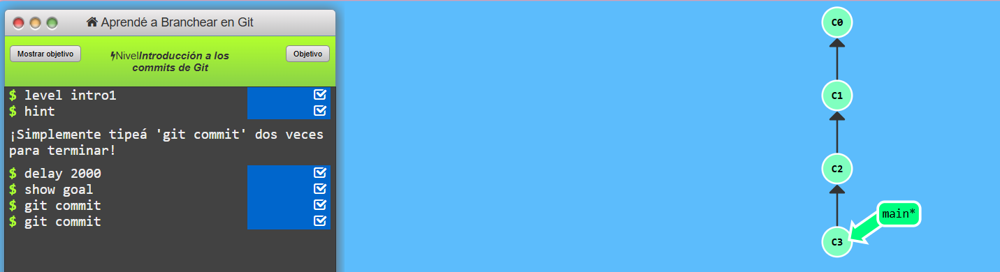

**Aprendizaje:**  
Cada commit representa un nuevo punto del historial del proyecto. Cuando se realiza un commit desde una rama activa, dicha rama avanza automáticamente al nuevo commit.

---

## M1.2 - Branching in Git

**Objetivo:**  
Crear una nueva rama y cambiar el trabajo hacia ella.

**Estado inicial:**  
Existe la rama `main` y `HEAD` apunta a ella.

| Paso | Comando | Efecto sobre el repositorio |
|---:|---|---|
| 1 | `git branch bugFix` | Crea la rama `bugFix` apuntando al mismo commit actual de `main`. |
| 2 | `git checkout bugFix` | Cambia la rama activa a `bugFix`; `HEAD` queda asociado a esta rama. |

**Estado final:**  
Existen las ramas `main` y `bugFix`, pero `HEAD` se encuentra sobre `bugFix`.

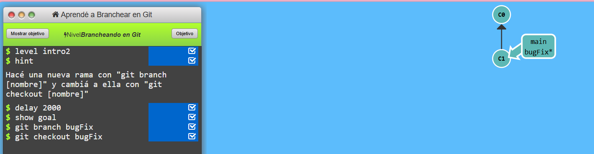

**Aprendizaje:**  
Una rama es una referencia móvil hacia un commit. Crear una rama no cambia automáticamente hacia ella; es necesario utilizar `checkout` o una alternativa equivalente.

---

## M1.3 - Merging in Git

**Objetivo:**  
Crear historias de trabajo diferentes en dos ramas y posteriormente unirlas mediante una fusión.

**Estado inicial:**  
El repositorio inicia en `main`, sin la rama `bugFix`.

| Paso | Comando | Efecto sobre el repositorio |
|---:|---|---|
| 1 | `git checkout -b bugFix` | Crea la rama `bugFix` y cambia inmediatamente hacia ella. |
| 2 | `git commit` | Crea un nuevo commit en `bugFix`. |
| 3 | `git checkout main` | Cambia nuevamente a la rama `main`. |
| 4 | `git commit` | Crea un nuevo commit independiente en `main`, produciendo una divergencia entre las dos ramas. |
| 5 | `git merge bugFix` | Fusiona el historial de `bugFix` con `main`. |

**Estado final:**  
Los cambios realizados en las dos ramas quedan integrados. `main` contiene tanto su trabajo como el realizado previamente en `bugFix`.

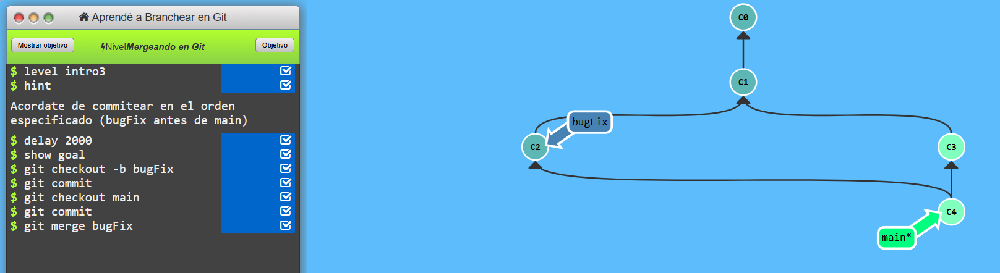

**Aprendizaje:**  
`merge` permite integrar dos líneas de desarrollo conservando la estructura de divergencia del historial.

---

## M1.4 - Rebase Introduction

**Objetivo:**  
Integrar los cambios de dos ramas utilizando `rebase` en lugar de una fusión tradicional.

**Estado inicial:**  
El repositorio comienza desde `main`.

| Paso | Comando | Efecto sobre el repositorio |
|---:|---|---|
| 1 | `git checkout -b bugFix` | Crea `bugFix` y cambia hacia esta rama. |
| 2 | `git commit` | Crea un commit en `bugFix`. |
| 3 | `git checkout main` | Regresa a `main`. |
| 4 | `git commit` | Crea un commit nuevo en `main`, provocando una divergencia. |
| 5 | `git checkout bugFix` | Cambia nuevamente a `bugFix`. |
| 6 | `git rebase main` | Reaplica los commits exclusivos de `bugFix` sobre el extremo actual de `main`. |

**Estado final:**  
El historial de `bugFix` queda colocado después de `main`, obteniéndose una historia lineal.

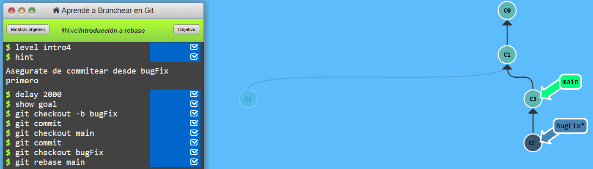

**Aprendizaje:**  
A diferencia de `merge`, `rebase` reconstruye los commits sobre una nueva base y permite obtener un historial más lineal.

---

# M2 - Ramping Up

## M2.1 - Detach yo' HEAD

**Objetivo:**  
Separar `HEAD` de una rama y hacer que apunte directamente hacia un commit específico.

**Estado inicial:**  
`HEAD` se encuentra asociado a una rama del repositorio.

| Paso | Comando | Efecto sobre el repositorio |
|---:|---|---|
| 1 | `git checkout C4` | Hace que `HEAD` apunte directamente al commit `C4`, en lugar de apuntar mediante una rama. |

**Estado final:**  
`HEAD` se encuentra en estado **detached HEAD**, apuntando directamente a `C4`.

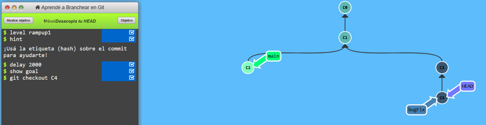

**Aprendizaje:**  
`HEAD` normalmente identifica la rama activa, pero también puede apuntar directamente a un commit. En ese caso se encuentra separado o *detached*.

---

## M2.2 - Relative Refs (^)

**Objetivo:**  
Utilizar referencias relativas para desplazarse hacia el padre de un commit.

**Estado inicial:**  
La rama `bugFix` apunta a un commit que posee un commit padre.

| Paso | Comando | Efecto sobre el repositorio |
|---:|---|---|
| 1 | `git checkout bugFix^` | Cambia `HEAD` al commit padre del commit señalado por `bugFix`. |

**Estado final:**  
`HEAD` queda separado y situado un nivel antes que `bugFix`.

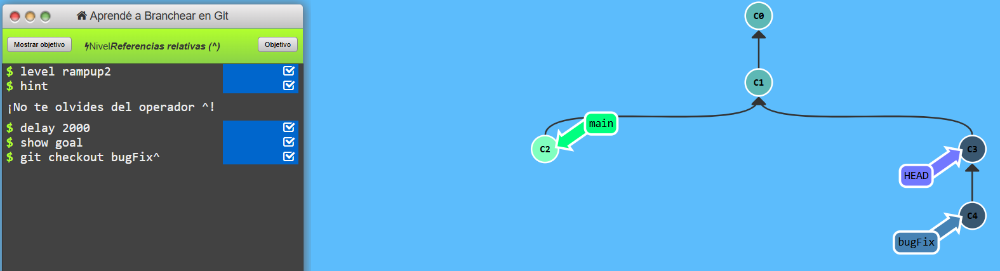

**Aprendizaje:**  
El operador `^` permite referirse al padre inmediato de un commit sin conocer directamente su identificador.

---

## M2.3 - Relative Refs #2 (~)

**Objetivo:**  
Combinar referencias relativas con movimientos forzados de ramas.

**Estado inicial:**  
Existen las ramas `main` y `bugFix` en diferentes posiciones dentro del historial.

| Paso | Comando | Efecto sobre el repositorio |
|---:|---|---|
| 1 | `git branch -f main C6` | Fuerza a `main` a apuntar al commit `C6`. |
| 2 | `git checkout HEAD~1` | Mueve `HEAD` un commit hacia atrás utilizando la referencia relativa `~1`. |
| 3 | `git branch -f bugFix HEAD~1` | Fuerza a `bugFix` a apuntar un commit antes de la posición actual de `HEAD`. |

**Estado final:**  
Las referencias de las ramas se encuentran en las posiciones solicitadas por el ejercicio.

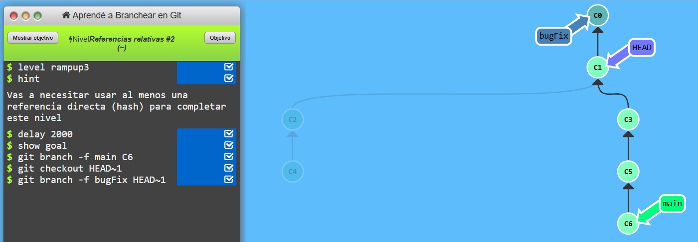

**Aprendizaje:**  
El operador `~n` permite retroceder `n` generaciones dentro del historial. La opción `-f` permite reposicionar una rama directamente.

---

## M2.4 - Reversing Changes in Git

**Objetivo:**  
Comprender la diferencia entre deshacer cambios mediante `reset` y mediante `revert`.

**Estado inicial:**  
Existen dos ramas que representan diferentes situaciones de recuperación de cambios.

| Paso | Comando | Efecto sobre el repositorio |
|---:|---|---|
| 1 | `git reset HEAD~1` | Hace retroceder la rama actual un commit. |
| 2 | `git checkout pushed` | Cambia hacia la rama `pushed`. |
| 3 | `git revert HEAD` | Crea un commit nuevo que invierte los cambios introducidos por el commit actual. |

**Estado final:**  
Una rama fue modificada mediante `reset`, mientras que la otra conserva su historial y agrega un nuevo commit inverso mediante `revert`.

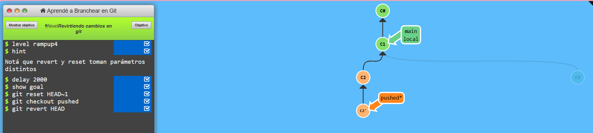

**Aprendizaje:**  
`reset` modifica la referencia de una rama, mientras que `revert` conserva el historial y agrega un nuevo commit que deshace cambios anteriores.

---

# M3 - Moving Work Around

## M3.1 - Cherry-pick Intro

**Objetivo:**  
Copiar commits específicos de otra parte del historial hacia la rama actual.

**Estado inicial:**  
Existen varios commits en otras líneas del historial que no forman parte de la rama actual.

| Paso | Comando | Efecto sobre el repositorio |
|---:|---|---|
| 1 | `git cherry-pick C3 C4 C7` | Copia los cambios de `C3`, `C4` y `C7` y crea nuevas versiones de estos commits sobre la rama actual. |

**Estado final:**  
La rama actual contiene copias de los tres commits seleccionados.

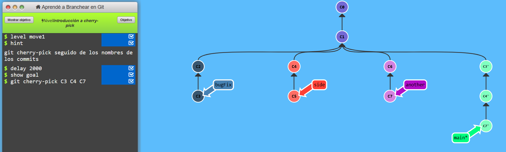

**Aprendizaje:**  
`cherry-pick` permite seleccionar únicamente los commits necesarios sin tener que integrar una rama completa.

---

## M3.2 - Interactive Rebase Intro

**Objetivo:**  
Reorganizar commits utilizando un rebase interactivo.

**Estado inicial:**  
Existen varios commits entre la rama actual y la referencia `overHere`.

| Paso | Comando | Efecto sobre el repositorio |
|---:|---|---|
| 1 | `git rebase -i overHere --solution-ordering C3,C5,C4` | Ejecuta un rebase interactivo y reorganiza los commits en el orden `C3`, `C5`, `C4`. |

**Estado final:**  
Los commits aparecen reescritos en el orden solicitado por el objetivo.

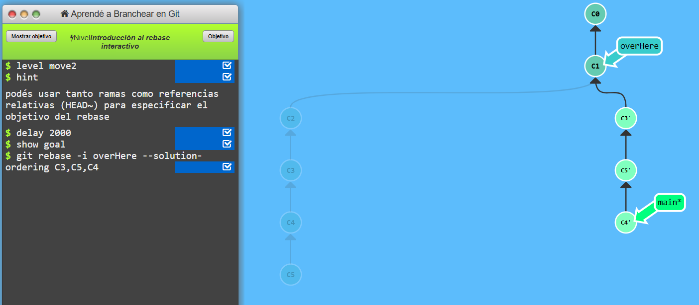

**Aprendizaje:**  
El rebase interactivo permite reorganizar el historial y seleccionar el orden en el que deben aparecer determinados commits.

---

## M3.3 - Área de Staging

**Nota:**  
Este nivel corresponde al identificador interno `move3` de Learn Git Branching y no aparece dentro de los 18 niveles de `Main` indicados originalmente en el enunciado del laboratorio.

**Objetivo:**  
Practicar el uso del área de *staging* para seleccionar qué archivos serán incluidos en cada commit.

**Estado inicial:**  
El repositorio contiene modificaciones en distintos archivos que deben almacenarse en commits separados.

| Paso | Comando | Efecto sobre el repositorio |
|---:|---|---|
| 1 | `git add app.js` | Agrega los cambios de `app.js` al área de *staging*. |
| 2 | `git commit` | Crea un nuevo commit con los cambios preparados de `app.js`. |
| 3 | `git add styles.css` | Agrega los cambios de `styles.css` al área de *staging*. |
| 4 | `git commit` | Crea un segundo commit con los cambios preparados de `styles.css`. |

**Estado final:**  
Los cambios de `app.js` y `styles.css` quedan registrados en dos commits independientes.

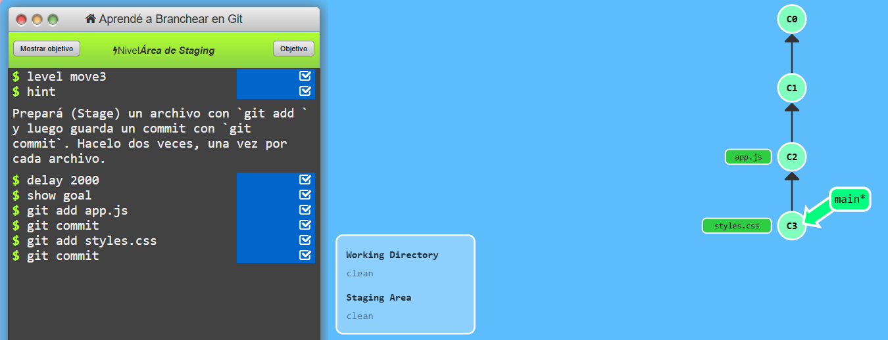

**Aprendizaje:**  
`git add` no crea un commit. Su función es preparar los cambios para decidir exactamente qué archivos formarán parte del siguiente `git commit`.

---

## M3.4 - Undoing with git restore

**Nota:**  
Este nivel corresponde al identificador interno `move4` y también se encuentra fuera del conjunto de 18 niveles de `Main` especificado originalmente en el laboratorio.

**Objetivo:**  
Utilizar `git restore` para retirar un archivo del área de *staging* y descartar modificaciones de otro archivo.

**Estado inicial:**  
El archivo `secret.env` se encuentra preparado para formar parte de un commit y `experiment.js` posee modificaciones que deben descartarse.

| Paso | Comando | Efecto sobre el repositorio |
|---:|---|---|
| 1 | `git restore --staged secret.env` | Retira `secret.env` del área de *staging`, evitando que forme parte del próximo commit. |
| 2 | `git restore experiment.js` | Descarta las modificaciones no confirmadas realizadas sobre `experiment.js`. |
| 3 | `git commit` | Crea un commit con los cambios que permanecen correctamente preparados. |

**Estado final:**  
`secret.env` queda fuera del commit y los cambios de `experiment.js` son descartados.

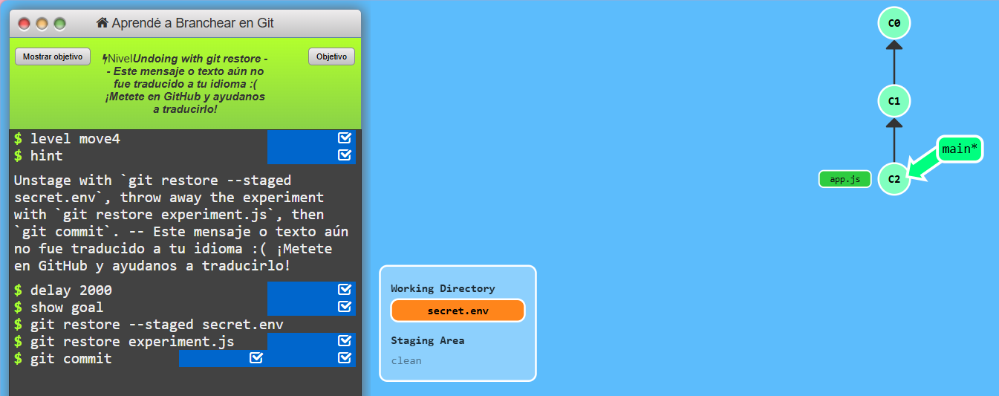

**Aprendizaje:**  
`git restore --staged` permite retirar cambios del área de *staging* sin necesariamente borrarlos del directorio de trabajo, mientras que `git restore archivo` puede utilizarse para descartar modificaciones locales.

---

# M4 - A Mixed Bag

## M4.1 - Grabbing Just 1 Commit

**Objetivo:**  
Conservar únicamente un commit específico y moverlo hacia la rama principal.

**Estado inicial:**  
La rama de trabajo contiene varios commits, aunque únicamente uno debe incorporarse a `main`.

| Paso | Comando | Efecto sobre el repositorio |
|---:|---|---|
| 1 | `git rebase -i main --solution-ordering C4` | Utiliza un rebase interactivo para seleccionar el commit `C4`. |
| 2 | `git rebase bugFix main` | Reubica `main` sobre el historial resultante de `bugFix`. |

**Estado final:**  
El commit requerido queda incorporado en la posición solicitada.

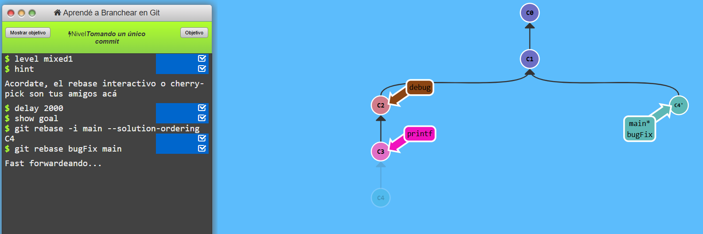

**Aprendizaje:**  
El rebase interactivo también puede emplearse para seleccionar únicamente determinados commits de una rama.

---

## M4.2 - Juggling Commits

**Objetivo:**  
Modificar el orden y contenido de commits existentes.

**Estado inicial:**  
Los últimos commits se encuentran en un orden diferente al solicitado.

| Paso | Comando | Efecto sobre el repositorio |
|---:|---|---|
| 1 | `git rebase -i HEAD~2 --solution-ordering C3,C2` | Reordena los dos últimos commits. |
| 2 | `git commit --amend` | Modifica el commit actual y genera una nueva versión del mismo. |
| 3 | `git rebase -i HEAD~2 --solution-ordering C2'',C3'` | Reordena nuevamente las nuevas versiones de los commits. |
| 4 | `git rebase caption main` | Reubica `main` utilizando `caption` como referencia para alcanzar el resultado solicitado. |

**Estado final:**  
Los commits quedan reorganizados y uno de ellos modificado.

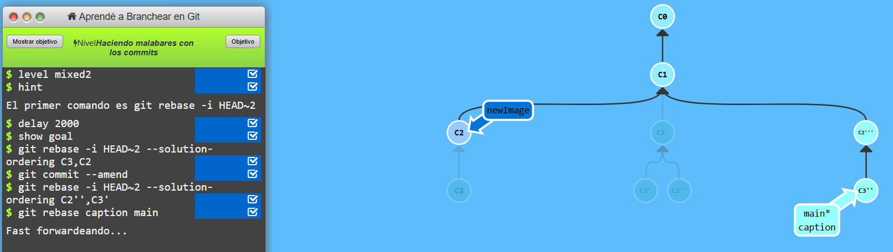

**Aprendizaje:**  
Modificar un commit ya existente genera en realidad un nuevo commit, por lo que cambia su identificador.

---

## M4.3 - Juggling Commits #2

**Objetivo:**  
Modificar commits utilizando `cherry-pick` y `commit --amend`.

**Estado inicial:**  
Existen commits que deben copiarse y uno de ellos debe ser modificado.

| Paso | Comando | Efecto sobre el repositorio |
|---:|---|---|
| 1 | `git checkout main` | Cambia hacia la rama `main`. |
| 2 | `git cherry-pick C2` | Copia `C2` sobre `main`. |
| 3 | `git commit --amend` | Modifica el último commit creado. |
| 4 | `git cherry-pick C3` | Copia `C3` después del commit modificado. |

**Estado final:**  
`main` contiene una versión modificada de `C2` seguida por una copia de `C3`.

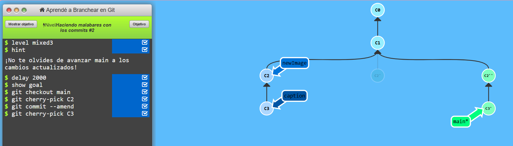

**Aprendizaje:**  
`cherry-pick` y `--amend` pueden combinarse para seleccionar y modificar commits específicos.

---

## M4.4 - Git Tags

**Objetivo:**  
Crear etiquetas permanentes sobre commits específicos.

**Estado inicial:**  
Existen las ramas `main` y `side`.

| Paso | Comando | Efecto sobre el repositorio |
|---:|---|---|
| 1 | `git tag v1 side~1` | Crea la etiqueta `v1` en el commit anterior a la punta de `side`. |
| 2 | `git tag v0 main~2` | Crea la etiqueta `v0` dos commits antes de `main`. |
| 3 | `git checkout v1` | Cambia `HEAD` hacia el commit identificado por `v1`. |

**Estado final:**  
Existen las etiquetas `v0` y `v1`; `HEAD` se encuentra sobre `v1`.

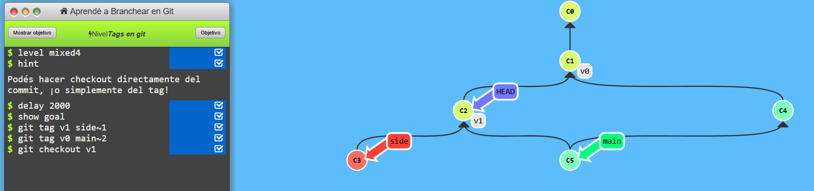

**Aprendizaje:**  
Los tags son referencias útiles para identificar versiones o puntos importantes del historial.

---

## M4.5 - Git Describe

**Objetivo:**  
Comprender cómo Git puede describir la posición de un commit respecto a etiquetas existentes.

**Estado inicial:**  
El repositorio contiene etiquetas y una rama `bugFix`.

| Paso | Comando | Efecto sobre el repositorio |
|---:|---|---|
| 1 | `git commit` | Crea un nuevo commit y modifica la distancia existente entre la posición actual y las etiquetas del historial. |

**Estado final:**  
Se obtiene la estructura requerida para interpretar la información generada por `git describe`.

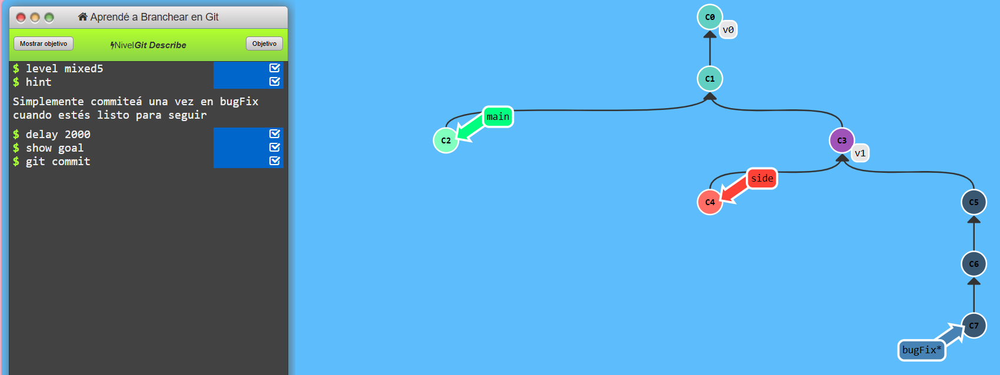

**Aprendizaje:**  
`git describe` permite identificar un commit utilizando el tag más cercano, la distancia en commits y parte de su hash.

---

# M5 - Advanced Topics

## M5.1 - Rebasing over 9000 times

**Objetivo:**  
Reordenar varias ramas mediante operaciones sucesivas de `rebase`.

**Estado inicial:**  
Existen las ramas `main`, `bugFix`, `side` y `another`.

| Paso | Comando | Efecto sobre el repositorio |
|---:|---|---|
| 1 | `git rebase main bugFix` | Reubica `bugFix` sobre `main`. |
| 2 | `git rebase bugFix side` | Reubica `side` sobre `bugFix`. |
| 3 | `git rebase side another` | Reubica `another` sobre `side`. |
| 4 | `git rebase another main` | Reubica finalmente `main` sobre `another`. |

**Estado final:**  
Las ramas quedan organizadas en una secuencia lineal.

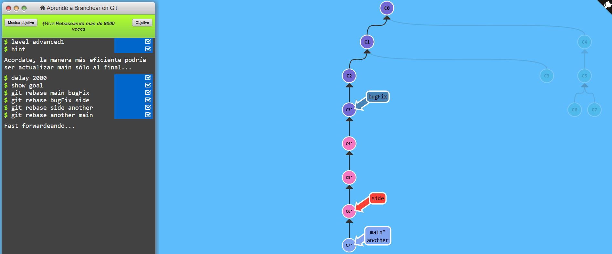

**Aprendizaje:**  
El rebase puede utilizarse repetidamente para reorganizar historiales complejos.

---

## M5.2 - Multiple Parents

**Objetivo:**  
Utilizar referencias relativas para navegar entre padres de commits de fusión.

**Estado inicial:**  
El historial contiene commits con más de un padre.

| Paso | Comando | Efecto sobre el repositorio |
|---:|---|---|
| 1 | `git branch bugWork main^^2^` | Navega mediante referencias relativas y crea `bugWork` en el commit solicitado. |

**Estado final:**  
`bugWork` apunta al commit requerido.

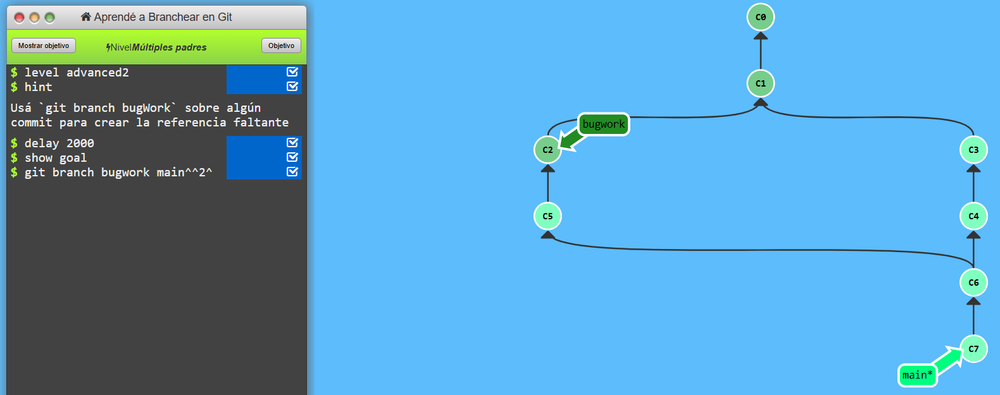

**Aprendizaje:**  
En un merge commit se puede indicar qué padre seguir utilizando referencias como `^1` o `^2`.

---

## M5.3 - Branch Spaghetti

**Objetivo:**  
Reorganizar un historial complejo mediante `cherry-pick` y reposicionamiento de ramas.

**Estado inicial:**  
Existen varias ramas distribuidas en diferentes partes del historial.

| Paso | Comando | Efecto sobre el repositorio |
|---:|---|---|
| 1 | `git checkout one` | Cambia hacia la rama `one`. |
| 2 | `git cherry-pick C4 C3 C2` | Copia los commits indicados sobre `one`. |
| 3 | `git checkout two` | Cambia hacia `two`. |
| 4 | `git cherry-pick C5 C4 C3 C2` | Copia cuatro commits sobre `two`. |
| 5 | `git branch -f three C2` | Fuerza `three` a apuntar directamente a `C2`. |

**Estado final:**  
Las tres ramas quedan posicionadas según el objetivo del ejercicio.

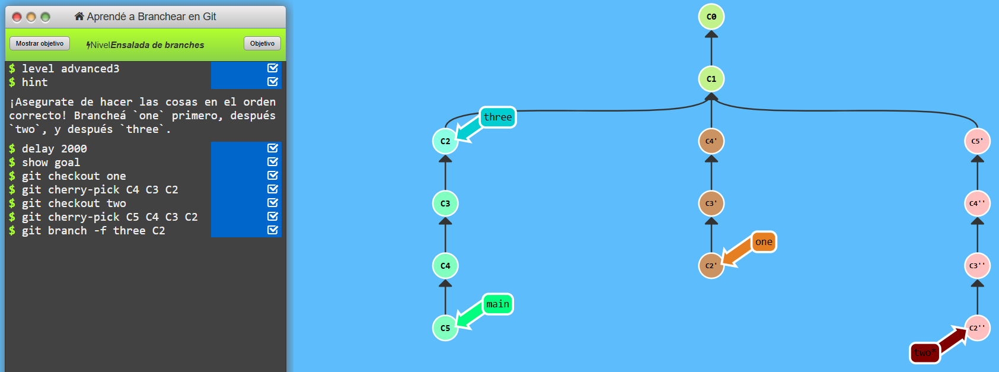

**Aprendizaje:**  
Las operaciones de Git pueden combinarse para reconstruir estructuras de historial complejas.

---

# 3. Sección Remote

# R1 - Push & Pull - Git Remotes

## R1.1 - Clone Intro

**Objetivo:**  
Crear una copia local de un repositorio remoto.

**Estado inicial:**  
Existe únicamente el repositorio remoto.

| Paso | Comando | Efecto sobre el repositorio |
|---:|---|---|
| 1 | `git clone` | Crea una copia local del repositorio remoto con su historial y referencias. |

**Estado final:**  
Existe un repositorio local sincronizado inicialmente con el remoto.

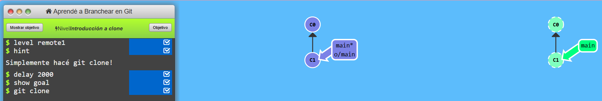

**Aprendizaje:**  
`clone` permite iniciar trabajo local a partir de un proyecto existente en un repositorio remoto.

---

## R1.2 - Remote Branches

**Objetivo:**  
Comprender la diferencia entre ramas locales y referencias de seguimiento remoto.

**Estado inicial:**  
El repositorio posee `main` y la referencia remota `o/main`.

| Paso | Comando | Efecto sobre el repositorio |
|---:|---|---|
| 1 | `git commit` | Crea un commit únicamente en la rama local. |
| 2 | `git checkout o/main` | Coloca `HEAD` directamente sobre la referencia `o/main`. |
| 3 | `git commit` | En el simulador crea un commit desde un estado de detached HEAD. |

**Estado final:**  
La rama local y la referencia remota quedan en diferentes posiciones.

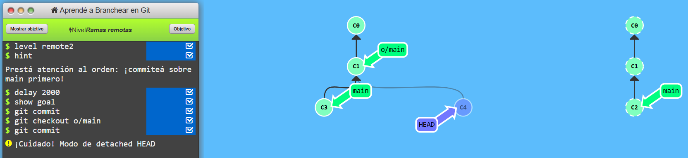

**Aprendizaje:**  
`o/main` representa en Learn Git Branching la referencia `origin/main`, que contiene el último estado conocido de la rama remota.

---

## R1.3 - Git Fetchin'

**Objetivo:**  
Actualizar la información del repositorio remoto sin integrar los cambios en la rama actual.

**Estado inicial:**  
Existen cambios nuevos en el remoto.

| Paso | Comando | Efecto sobre el repositorio |
|---:|---|---|
| 1 | `git fetch` | Descarga commits y actualiza las referencias remotas locales, sin modificar la rama actual. |

**Estado final:**  
El repositorio local conoce los cambios del remoto, pero todavía no los integra en `main`.

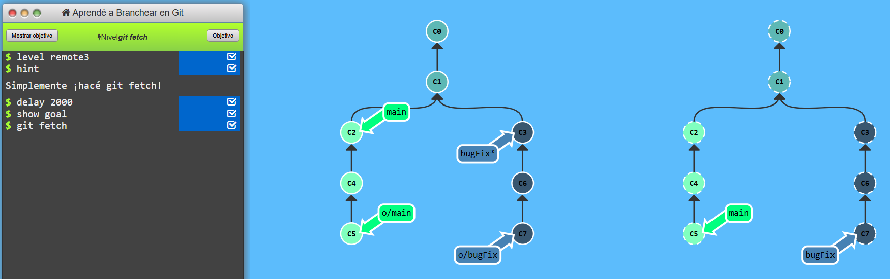

**Aprendizaje:**  
`fetch` descarga información sin modificar automáticamente el trabajo local.

---

## R1.4 - Git Pullin'

**Objetivo:**  
Descargar e integrar cambios del repositorio remoto.

**Estado inicial:**  
Existen commits nuevos en el remoto.

| Paso | Comando | Efecto sobre el repositorio |
|---:|---|---|
| 1 | `git pull` | Descarga los cambios y los integra en la rama actual. |

**Estado final:**  
La rama local contiene los cambios disponibles en el remoto.

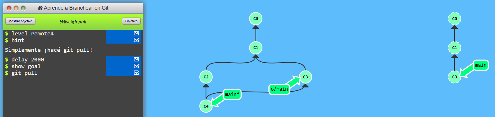

**Aprendizaje:**  
`pull` normalmente combina una operación de `fetch` con una integración posterior.

---

## R1.5 - Faking Teamwork

**Objetivo:**  
Simular trabajo realizado por otra persona y sincronizarlo con cambios locales.

**Estado inicial:**  
Existe un repositorio remoto que debe clonarse.

| Paso | Comando | Efecto sobre el repositorio |
|---:|---|---|
| 1 | `git clone` | Crea una copia local del repositorio remoto. |
| 2 | `git fakeTeamwork 2` | Comando exclusivo del simulador que genera dos commits remotos simulando trabajo de otra persona. |
| 3 | `git commit` | Crea un nuevo commit local. |
| 4 | `git pull` | Descarga e integra los commits remotos. |

**Estado final:**  
El trabajo local y remoto queda integrado.

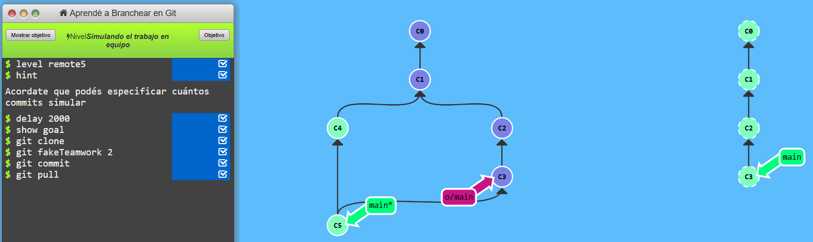

**Aprendizaje:**  
En un proyecto colaborativo el historial remoto puede cambiar mientras se trabaja localmente.

---

## R1.6 - Git Pushin'

**Objetivo:**  
Enviar commits locales hacia el repositorio remoto.

**Estado inicial:**  
El repositorio local y remoto se encuentran inicialmente sincronizados.

| Paso | Comando | Efecto sobre el repositorio |
|---:|---|---|
| 1 | `git commit` | Crea un commit local. |
| 2 | `git commit` | Crea un segundo commit local. |
| 3 | `git push` | Envía los commits locales al remoto. |

**Estado final:**  
El remoto queda actualizado con los nuevos commits.

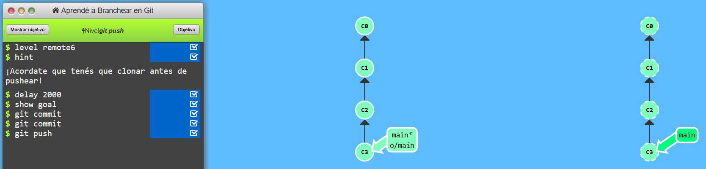

**Aprendizaje:**  
`push` permite publicar los commits locales en un repositorio remoto.

---

## R1.7 - Diverged History

**Objetivo:**  
Resolver una situación donde el repositorio local y remoto han avanzado de manera diferente.

**Estado inicial:**  
Inicialmente ambos repositorios están sincronizados.

| Paso | Comando | Efecto sobre el repositorio |
|---:|---|---|
| 1 | `git clone` | Clona el repositorio. |
| 2 | `git fakeTeamwork` | Simula un cambio realizado en el remoto. |
| 3 | `git commit` | Crea un commit local distinto. |
| 4 | `git pull --rebase` | Descarga los cambios remotos y reaplica el commit local sobre ellos. |
| 5 | `git push` | Publica el historial resultante. |

**Estado final:**  
El remoto y el repositorio local quedan sincronizados con una historia lineal.

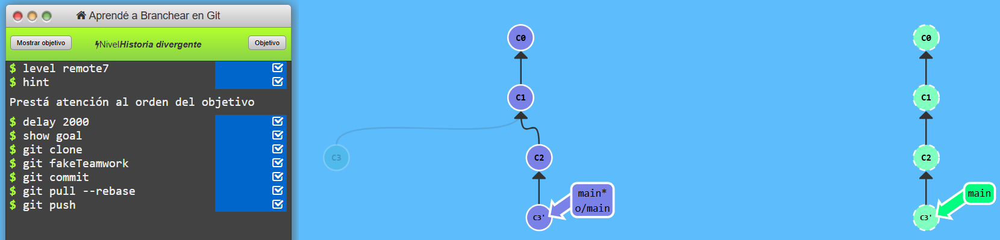

**Aprendizaje:**  
`pull --rebase` permite integrar cambios remotos evitando un merge commit adicional.

---

## R1.8 - Locked Main

**Objetivo:**  
Utilizar una rama `feature` cuando la rama `main` no debe modificarse directamente.

**Estado inicial:**  
`main` local debe restablecerse para coincidir con `o/main`.

| Paso | Comando | Efecto sobre el repositorio |
|---:|---|---|
| 1 | `git branch -f main o/main` | Fuerza `main` local para que apunte al mismo commit que `o/main`. |
| 2 | `git checkout -b feature C2` | Crea `feature` desde `C2` y cambia hacia ella. |
| 3 | `git push origin feature` | Publica `feature` en el repositorio remoto. |

**Estado final:**  
`main` queda restaurada y el trabajo se publica mediante una rama independiente.

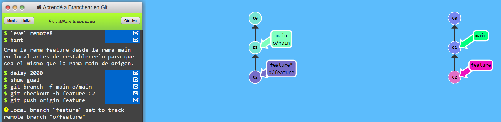

**Aprendizaje:**  
Las ramas protegidas como `main` pueden mantenerse estables mientras el trabajo nuevo se desarrolla en ramas independientes.

---

# R2 - To Origin And Beyond - Advanced Git Remotes

## R2.1 - Push Main!

**Objetivo:**  
Integrar varias ramas mediante rebase antes de enviar el resultado a `origin`.

**Estado inicial:**  
Existen varias ramas locales y cambios en el remoto.

| Paso | Comando | Efecto sobre el repositorio |
|---:|---|---|
| 1 | `git fetch` | Actualiza la información del repositorio remoto. |
| 2 | `git rebase o/main side1` | Reubica `side1` sobre `o/main`. |
| 3 | `git rebase side1 side2` | Reubica `side2` sobre `side1`. |
| 4 | `git rebase side2 side3` | Reubica `side3` sobre `side2`. |
| 5 | `git rebase side3 main` | Reubica `main` sobre `side3`. |
| 6 | `git push` | Envía el resultado final al remoto. |

**Estado final:**  
Las ramas quedan organizadas linealmente y `main` queda publicada en el remoto.

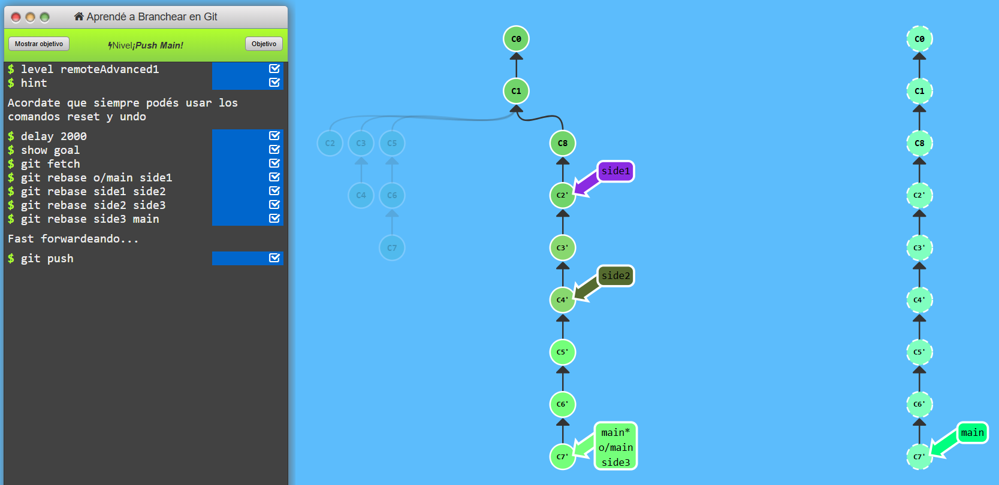

**Aprendizaje:**  
`fetch`, `rebase` y `push` pueden combinarse para integrar varias líneas de trabajo.

---

## R2.2 - Merging with Remotes

**Objetivo:**  
Integrar diferentes ramas utilizando `merge`.

**Estado inicial:**  
Existen varias ramas locales que deben incorporarse a `main`.

| Paso | Comando | Efecto sobre el repositorio |
|---:|---|---|
| 1 | `git checkout main` | Cambia hacia `main`. |
| 2 | `git pull` | Actualiza `main` con el remoto. |
| 3 | `git merge side1` | Integra `side1`. |
| 4 | `git merge side2` | Integra `side2`. |
| 5 | `git merge side3` | Integra `side3`. |
| 6 | `git push` | Publica el historial resultante. |

**Estado final:**  
Los cambios de las tres ramas quedan integrados en `main`.

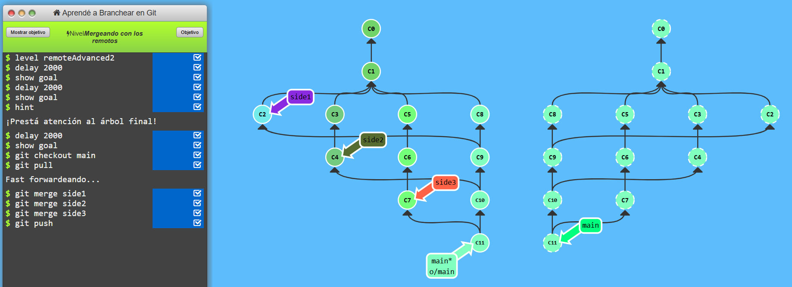

**Aprendizaje:**  
`merge` conserva explícitamente las diferentes líneas de desarrollo que existieron.

---

## R2.3 - Remote Tracking

**Objetivo:**  
Crear una rama local asociada a una referencia remota.

**Estado inicial:**  
Existe la referencia remota `o/main`.

| Paso | Comando | Efecto sobre el repositorio |
|---:|---|---|
| 1 | `git checkout -b side o/main` | Crea la rama local `side` desde `o/main`. |
| 2 | `git commit` | Crea un commit sobre `side`. |
| 3 | `git pull --rebase` | Descarga actualizaciones remotas y reaplica el trabajo local. |
| 4 | `git push` | Publica los cambios en el remoto. |

**Estado final:**  
La rama local y su correspondiente referencia remota quedan sincronizadas.

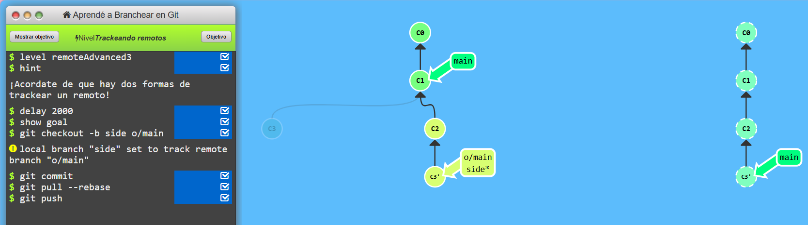

**Aprendizaje:**  
Una rama local puede configurarse para seguir una rama remota y facilitar operaciones de sincronización.

---

## R2.4 - Git push arguments

**Objetivo:**  
Especificar explícitamente el remoto y la rama durante `push`.

**Estado inicial:**  
Existen las ramas `main` y `foo`.

| Paso | Comando | Efecto sobre el repositorio |
|---:|---|---|
| 1 | `git push origin main` | Envía `main` al remoto `origin`. |
| 2 | `git push origin foo` | Envía `foo` al mismo remoto. |

**Estado final:**  
Las ramas remotas correspondientes quedan actualizadas.

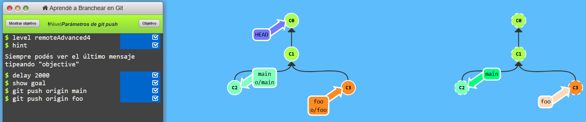

**Aprendizaje:**  
Los argumentos de `push` permiten especificar qué rama se desea publicar y hacia qué remoto.

---

## R2.5 - Git push arguments - Expanded!

**Objetivo:**  
Controlar independientemente la referencia local que se envía y la rama remota que se actualiza.

**Estado inicial:**  
Existen las ramas `main` y `foo`.

| Paso | Comando | Efecto sobre el repositorio |
|---:|---|---|
| 1 | `git push origin main^:foo` | Envía el padre de `main` hacia la rama remota `foo`. |
| 2 | `git push origin foo:main` | Envía la rama local `foo` hacia la rama remota `main`. |

**Estado final:**  
Las ramas remotas quedan en las posiciones solicitadas.

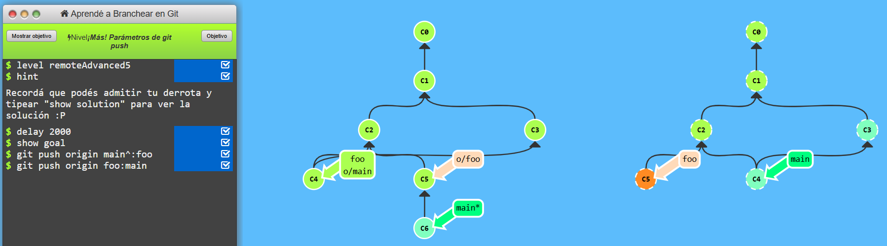

**Aprendizaje:**  
La sintaxis `<origen>:<destino>` permite enviar una referencia local hacia una rama remota con un nombre o posición diferente.

---

## R2.6 - Fetch arguments

**Objetivo:**  
Especificar qué referencias descargar y dónde almacenarlas localmente.

**Estado inicial:**  
Existen commits remotos que deben descargarse hacia referencias locales concretas.

| Paso | Comando | Efecto sobre el repositorio |
|---:|---|---|
| 1 | `git fetch origin C3:foo` | Descarga `C3` y actualiza la rama local `foo`. |
| 2 | `git fetch origin C6:main` | Descarga `C6` y actualiza `main`. |
| 3 | `git checkout foo` | Cambia hacia `foo`. |
| 4 | `git merge main` | Fusiona `main` con `foo`. |

**Estado final:**  
Las referencias descargadas quedan ubicadas e integradas según el objetivo.

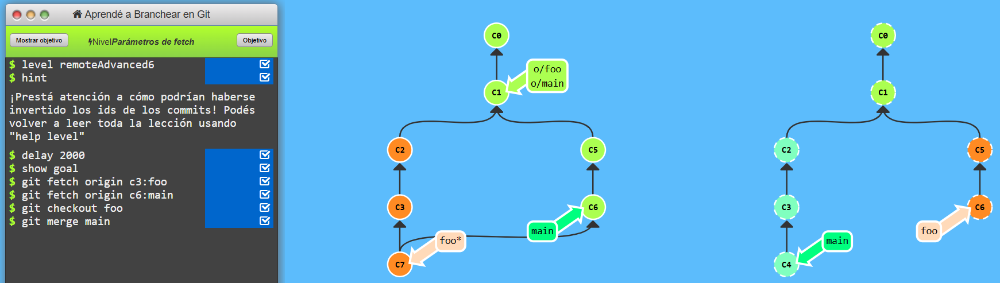

**Aprendizaje:**  
`fetch` también permite especificar referencias de origen y destino mediante `source:destination`.

---

## R2.7 - Source of Nothing

**Objetivo:**  
Comprender el significado de utilizar una referencia vacía como origen.

**Estado inicial:**  
Existen ramas que deben modificarse utilizando una fuente vacía.

| Paso | Comando | Efecto sobre el repositorio |
|---:|---|---|
| 1 | `git push origin :foo` | Envía una referencia vacía hacia `foo`, eliminando la rama remota `foo`. |
| 2 | `git fetch origin :bar` | Utiliza una fuente vacía con `fetch` para crear o actualizar la referencia local solicitada por el ejercicio. |

**Estado final:**  
Las referencias quedan modificadas según el comportamiento esperado con una fuente vacía.

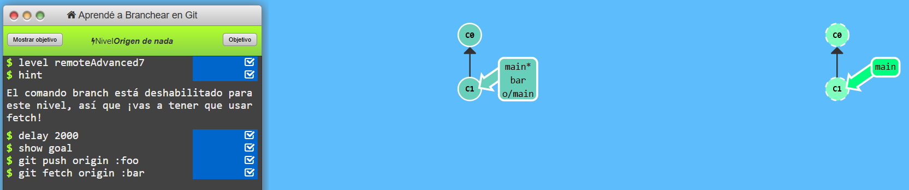

**Aprendizaje:**  
En operaciones remotas, una referencia vacía antes de `:` tiene un significado especial. En `push`, puede utilizarse para eliminar una rama remota.

---

## R2.8 - Pull arguments

**Objetivo:**  
Utilizar argumentos específicos con `pull` para controlar las referencias descargadas.

**Estado inicial:**  
Existen commits remotos que deben incorporarse a ramas locales específicas.

| Paso | Comando | Efecto sobre el repositorio |
|---:|---|---|
| 1 | `git pull origin C3:foo` | Descarga `C3` hacia `foo` y realiza posteriormente la integración correspondiente. |
| 2 | `git pull origin C2:side` | Descarga `C2` hacia `side` y realiza la integración correspondiente. |

**Estado final:**  
Las referencias locales quedan actualizadas según el objetivo.

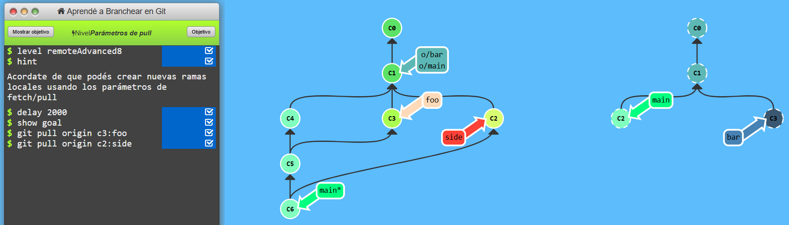

**Aprendizaje:**  
Los argumentos de `pull` permiten controlar qué referencias se descargan y dónde se almacenan antes de realizar la integración.

---

# 4. Evidencias de progreso

## Progreso completo de Main

La siguiente captura muestra la finalización de los niveles correspondientes a la sección `Main`.

En la versión utilizada de la plataforma aparecen **20 niveles de Main**, incluyendo los dos niveles adicionales `Área de Staging` y `Undoing with git restore`.

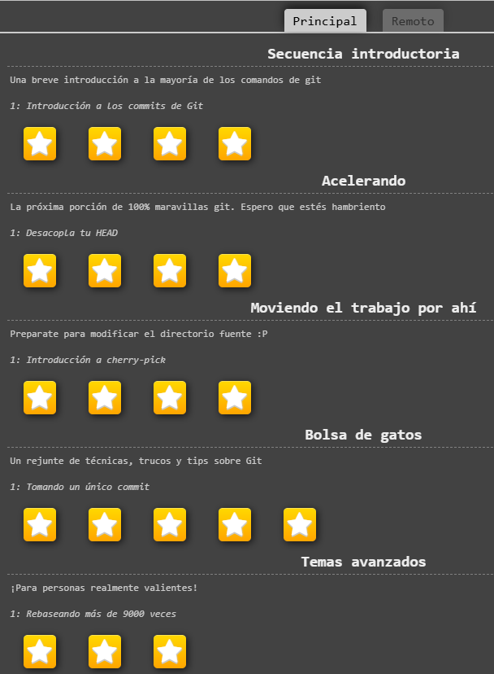

## Progreso completo de Remote

La siguiente captura muestra la finalización de los 16 niveles correspondientes a la sección `Remote`.

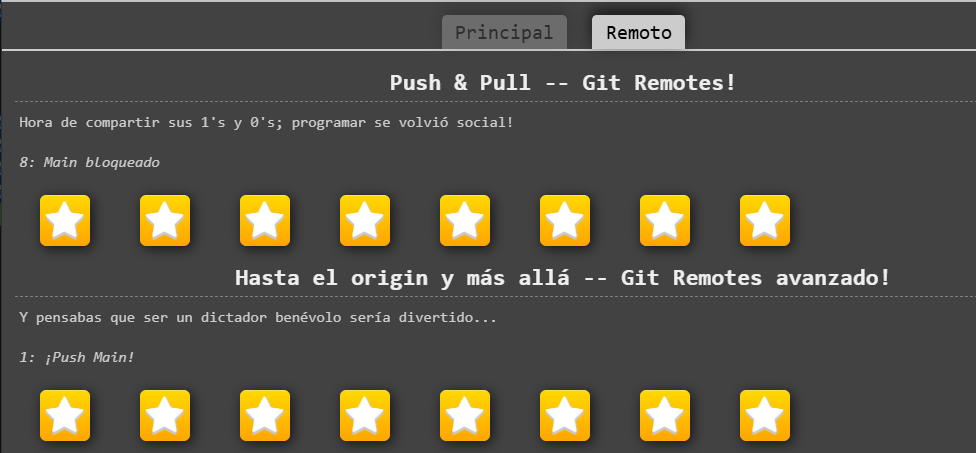

---

# 5. Tabla resumen de niveles completados

| ID | Nivel | Estado |
|---|---|---|
| M1.1 | Introduction to Git Commits | Completado |
| M1.2 | Branching in Git | Completado |
| M1.3 | Merging in Git | Completado |
| M1.4 | Rebase Introduction | Completado |
| M2.1 | Detach yo' HEAD | Completado |
| M2.2 | Relative Refs (`^`) | Completado |
| M2.3 | Relative Refs #2 (`~`) | Completado |
| M2.4 | Reversing Changes in Git | Completado |
| M3.1 | Cherry-pick Intro | Completado |
| M3.2 | Interactive Rebase Intro | Completado |
| M3.3 | Área de Staging | Completado - Nivel adicional |
| M3.4 | Undoing with git restore | Completado - Nivel adicional |
| M4.1 | Grabbing Just 1 Commit | Completado |
| M4.2 | Juggling Commits | Completado |
| M4.3 | Juggling Commits #2 | Completado |
| M4.4 | Git Tags | Completado |
| M4.5 | Git Describe | Completado |
| M5.1 | Rebasing over 9000 times | Completado |
| M5.2 | Multiple parents | Completado |
| M5.3 | Branch Spaghetti | Completado |
| R1.1 | Clone Intro | Completado |
| R1.2 | Remote Branches | Completado |
| R1.3 | Git Fetchin' | Completado |
| R1.4 | Git Pullin' | Completado |
| R1.5 | Faking Teamwork | Completado |
| R1.6 | Git Pushin' | Completado |
| R1.7 | Diverged History | Completado |
| R1.8 | Locked Main | Completado |
| R2.1 | Push Main! | Completado |
| R2.2 | Merging with remotes | Completado |
| R2.3 | Remote Tracking | Completado |
| R2.4 | Git push arguments | Completado |
| R2.5 | Git push arguments - Expanded! | Completado |
| R2.6 | Fetch arguments | Completado |
| R2.7 | Source of nothing | Completado |
| R2.8 | Pull arguments | Completado |

**Total realizado: 36 niveles completados.**

De estos, **34 corresponden al alcance obligatorio indicado en el enunciado del laboratorio** y **2 corresponden a niveles adicionales presentes en la versión de Learn Git Branching utilizada**.

---

# 6. Síntesis de conceptos aprendidos

La realización de los niveles de Learn Git Branching permitió comprender Git no solamente como una herramienta para guardar versiones de archivos, sino como un sistema que administra un historial formado por commits y referencias. Cada commit representa un estado del proyecto relacionado con uno o más commits anteriores. Las ramas funcionan como referencias móviles que indican un punto específico del historial, mientras que `HEAD` identifica la posición actual desde la cual se está trabajando.

Los primeros ejercicios permitieron practicar la creación de commits y ramas y posteriormente estudiar dos mecanismos fundamentales para integrar trabajo: `merge` y `rebase`. `merge` combina dos líneas de desarrollo conservando la divergencia existente entre ellas, mientras que `rebase` toma determinados commits y los reconstruye sobre una nueva base, generando un historial más lineal. Esta diferencia permitió comprender también por qué reescribir un historial compartido puede provocar problemas en proyectos colaborativos.

Las referencias relativas `^` y `~` facilitaron la navegación entre commits sin necesidad de conocer directamente sus identificadores. También se utilizaron herramientas para modificar o recuperar el historial. `reset` permite mover una referencia hacia un commit anterior, mientras que `revert` conserva el historial y crea un nuevo commit que invierte cambios previamente realizados. `cherry-pick` permitió seleccionar commits individuales y copiarlos hacia otra rama, mientras que el rebase interactivo hizo posible reorganizar commits específicos.

La versión de Learn Git Branching utilizada incorporó además ejercicios relacionados con el área de *staging*. Estos permitieron comprobar que `git add` prepara los cambios que formarán parte del próximo commit y que `git restore` puede utilizarse tanto para retirar archivos del área de *staging* como para descartar modificaciones locales.

Los niveles también mostraron la utilidad de los tags para identificar puntos importantes del historial y permitieron estudiar situaciones especiales como un `HEAD` separado.

En la sección de repositorios remotos se comprendió la relación entre el repositorio local y `origin`. `clone` crea una copia local, `fetch` descarga nueva información sin integrarla automáticamente, `pull` descarga e integra cambios y `push` publica commits locales. También se analizó el concepto de referencia de seguimiento remoto, representada en el simulador mediante nombres como `o/main`.

Finalmente, la visualización gráfica de Learn Git Branching permitió relacionar cada comando con los movimientos de `HEAD`, ramas y commits, facilitando la comprensión del modelo interno de Git y de la manera en que se administran diferentes líneas de desarrollo dentro de un proyecto.

---

# 7. Análisis obligatorio de Git

## 7.1 ¿Cuál es la diferencia entre `merge` y `rebase`? ¿Qué ocurre con el historial en cada caso?

Tanto `merge` como `rebase` permiten integrar cambios procedentes de diferentes líneas de desarrollo, pero modifican el historial de manera distinta.

`merge` combina dos ramas conservando la estructura original de ambas historias. Cuando las ramas han divergido, normalmente se genera un **merge commit** que posee dos padres.

Por ejemplo, en el nivel **M1.3 - Merging in Git** se ejecutó:

```bash
git checkout -b bugFix
git commit
git checkout main
git commit
git merge bugFix
```

Primero se generó un commit distinto en cada rama y posteriormente `git merge bugFix` integró ambas historias.

En cambio, `rebase` toma los commits exclusivos de una rama y los vuelve a aplicar sobre otra base. En **M1.4 - Rebase Introduction** se utilizó:

```bash
git checkout bugFix
git rebase main
```

Los commits de `bugFix` fueron reconstruidos sobre `main`. Debido a que se crean nuevas versiones de esos commits, sus identificadores cambian.

Por lo tanto, `merge` conserva mejor la estructura original del historial, mientras que `rebase` permite generar una historia más lineal.

---

## 7.2 ¿Cuándo conviene utilizar `reset` y cuándo `revert`?

`reset` resulta apropiado principalmente para modificar trabajo local que todavía no ha sido compartido. Este comando mueve la referencia de una rama hacia otro commit.

En **M2.4 - Reversing Changes in Git** se utilizó:

```bash
git reset HEAD~1
```

Con esto, la rama retrocedió un commit.

`revert`, en cambio, resulta más apropiado cuando un cambio ya fue compartido, ya que no elimina ni reescribe el historial. En su lugar crea un nuevo commit que invierte las modificaciones del anterior.

En el mismo nivel se utilizó:

```bash
git revert HEAD
```

En términos generales, conviene utilizar `reset` cuando se trabaja sobre historial local que puede modificarse de forma segura y `revert` cuando se desea conservar la trazabilidad de cambios ya publicados.

---

## 7.3 ¿Qué significa tener `HEAD` separado o *detached*?

Normalmente `HEAD` apunta indirectamente a un commit mediante una rama:

```text
HEAD -> main -> C4
```

Sin embargo, también puede apuntar directamente a un commit:

```text
HEAD -> C4
```

Esta situación se conoce como **detached HEAD**.

En el nivel **M2.1 - Detach yo' HEAD** se utilizó:

```bash
git checkout C4
```

Al seleccionar directamente el commit, `HEAD` dejó de estar asociado con una rama.

Es posible inspeccionar o incluso crear commits en este estado, pero dichos commits no quedarán vinculados automáticamente a una rama. Si se desea conservar el trabajo, conviene crear una nueva rama.

---

## 7.4 ¿Qué diferencia existe entre una rama local, una rama remota y una rama de seguimiento remoto?

Una **rama local** es una referencia disponible dentro del repositorio local y sobre la cual se puede trabajar directamente. Algunos ejemplos son:

```text
main
bugFix
feature
```

Una **rama remota** es una rama que existe físicamente dentro de otro repositorio, por ejemplo en el repositorio denominado `origin`.

Una **referencia de seguimiento remoto** representa localmente el último estado conocido de una rama del remoto. El ejemplo más común es:

```text
origin/main
```

Learn Git Branching utiliza la abreviatura:

```text
o/main
```

para representar `origin/main`.

Una rama local también puede configurarse para seguir una rama remota. En el nivel **R2.3 - Remote Tracking** se utilizó:

```bash
git checkout -b side o/main
```

Esto facilita posteriormente operaciones como `pull` y `push`.

---

## 7.5 ¿Qué hacen individualmente `fetch`, `merge`, `pull` y `push`?

### `git fetch`

Descarga commits y referencias desde un repositorio remoto, pero no modifica automáticamente la rama en la que se está trabajando.

Por ejemplo:

```bash
git fetch
```

actualiza referencias como `origin/main`.

### `git merge`

Integra otra línea de desarrollo con la rama actual.

Por ejemplo:

```bash
git merge bugFix
```

Cuando las ramas han divergido, puede generar un merge commit.

### `git pull`

Descarga cambios desde el remoto y posteriormente los integra con la rama local.

De forma conceptual:

```text
git pull ≈ git fetch + git merge
```

También puede utilizarse:

```bash
git pull --rebase
```

para integrar los cambios mediante rebase.

### `git push`

Envía commits y referencias locales hacia un repositorio remoto.

Por ejemplo:

```bash
git push
```

permite publicar cambios que anteriormente existían únicamente en el repositorio local.

---

## 7.6 ¿Qué riesgos existen al reescribir un historial que ya fue compartido?

Reescribir un historial compartido puede producir problemas debido a que operaciones como `rebase`, `reset` o `commit --amend` pueden generar commits con identificadores diferentes.

Algunos comandos que pueden modificar la historia son:

```bash
git rebase
git commit --amend
git reset
```

Si otra persona ya descargó los commits originales y posteriormente se publica una versión reescrita, ambas historias pueden dejar de coincidir. Esto puede generar conflictos, commits duplicados y dificultades durante operaciones como `pull` o `push`.

Por esta razón, el rebase y otras operaciones de reescritura suelen utilizarse principalmente sobre trabajo local o ramas privadas antes de compartirlas.

---

## 7.7 ¿Para qué resultan útiles `cherry-pick`, las referencias relativas y los tags?

### `cherry-pick`

Permite copiar commits específicos hacia la rama actual.

Por ejemplo, en **M3.1**:

```bash
git cherry-pick C3 C4 C7
```

Esto permite incorporar cambios concretos sin integrar toda una rama.

### Referencias relativas

Permiten navegar por el historial sin conocer directamente los hashes.

Ejemplos:

```bash
bugFix^
HEAD~1
main~2
```

`^` permite acceder al padre de una referencia y `~n` permite retroceder varias generaciones.

### Tags

Permiten asignar nombres permanentes a commits importantes.

Por ejemplo:

```bash
git tag v1 side~1
git tag v0 main~2
```

Son especialmente útiles para identificar versiones de software o entregas importantes.

---

## 7.8 ¿Qué diferencias identificó entre el simulador y un repositorio Git real?

Learn Git Branching representa de manera simplificada y visual el funcionamiento de Git con fines educativos.

Una de las diferencias más evidentes es la forma de identificar los commits. En el simulador aparecen identificadores sencillos como:

```text
C0
C1
C2
C3
```

mientras que Git real utiliza hashes mucho más extensos, por ejemplo:

```text
a3f4298...
```

Otra diferencia se encuentra en las referencias remotas. Learn Git Branching utiliza:

```text
o/main
```

como abreviación visual de:

```text
origin/main
```

Además, existen comandos que únicamente funcionan dentro del simulador. Un ejemplo es:

```bash
git fakeTeamwork
```

utilizado para simular que otra persona realizó commits en el repositorio remoto.

También aparecen instrucciones propias de Learn Git Branching como:

```text
level remote5
hint
show goal
delay 2000
```

Estas instrucciones no forman parte de Git.

De la misma forma, opciones mostradas en algunas soluciones del simulador, como:

```text
--solution-ordering
```

son utilizadas por Learn Git Branching para representar de manera automática decisiones que en un repositorio real se realizarían mediante una interfaz interactiva.

En Git real también deben considerarse elementos que el simulador simplifica, como archivos reales, conflictos de contenido, el área de trabajo, credenciales, autenticación con servidores, configuraciones del repositorio y comunicación real con plataformas como GitHub.

La versión utilizada para este laboratorio presentó además dos niveles que no aparecían en la lista original del enunciado: **Área de Staging** y **Undoing with git restore**. Esto evidencia que Learn Git Branching puede actualizar sus contenidos y que la cantidad de niveles disponible puede cambiar entre versiones.

A pesar de estas diferencias, el simulador representa correctamente los conceptos fundamentales de Git y facilita especialmente la comprensión del grafo de commits, las ramas, `HEAD`, los merges, rebase y operaciones con repositorios remotos.