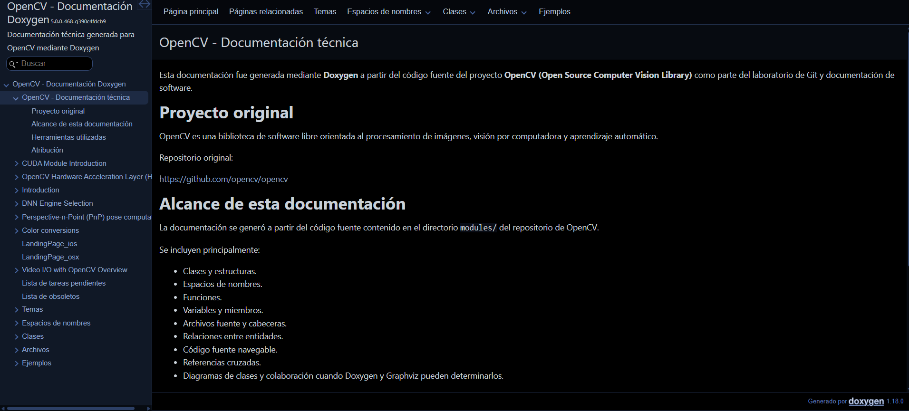

# Parte 3. Análisis de la documentación Doxygen de OpenCV

## Página principal y navegación

La documentación generada mediante Doxygen presenta una página principal
correspondiente al proyecto OpenCV y permite navegar por las diferentes
entidades identificadas durante el análisis del código fuente.

La estructura generada facilita el acceso a archivos, clases, estructuras,
espacios de nombres, funciones y otros elementos presentes en los diferentes
módulos del proyecto. Esta organización resulta especialmente útil debido al
tamaño de OpenCV, ya que permite consultar el código de manera estructurada sin
tener que recorrer manualmente todos los directorios y archivos del repositorio.

Además, la documentación permite acceder al código fuente asociado a las
entidades documentadas, lo que facilita relacionar una clase, función o
estructura con el archivo donde fue declarada o implementada.

La navegación generada por Doxygen sirve, por lo tanto, como una interfaz para
explorar la estructura interna del proyecto y localizar rápidamente los
componentes de interés.

**Evidencia:**  
[Pagina principal OPENCV](/site/cpp/index.html)



---

## Información de clases, estructuras, namespaces, archivos y funciones

Doxygen identificó y generó documentación para diferentes tipos de entidades
presentes en el código fuente de OpenCV, incluyendo clases, estructuras,
espacios de nombres, archivos y funciones.

La generación incluyó documentación específica de clases y otros tipos
compuestos. Para cada una de estas entidades se presentan elementos como su
nombre, miembros, métodos, constructores, variables y ubicación dentro del
proyecto.

También se generó documentación para los espacios de nombres utilizados por
OpenCV. Estos permiten observar cómo se organizan lógicamente las entidades y
qué clases, estructuras o funciones pertenecen a cada ámbito.

Asimismo, Doxygen generó páginas individuales para los archivos procesados,
incluyendo archivos de cabecera y archivos de implementación. De esta manera es
posible consultar directamente el contenido y las entidades declaradas en cada
archivo.

Entre los módulos procesados se encuentran `core`, `dnn`, `imgproc`, `calib`,
`videoio`, `features`, `geometry` y otros componentes del proyecto.

Esta organización facilita comprender la distribución del código y localizar
los elementos que pertenecen a cada módulo de OpenCV.

---

## Parámetros, retornos, miembros y relaciones

Las páginas generadas para funciones y métodos permiten observar sus firmas
directamente a partir del código fuente. Estas firmas muestran información como
el tipo de retorno, nombre de la función, tipos de datos de los parámetros y
nombres de los argumentos.

Cuando la documentación original de OpenCV incluye comentarios estructurados,
Doxygen también puede presentar información adicional sobre el propósito de la
función, descripción de los parámetros, valores retornados y comportamiento
esperado.

En las clases y estructuras se presentan los diferentes miembros identificados,
como métodos, constructores, operadores, variables y otros elementos de la
interfaz.

Además, Doxygen relaciona las entidades con los archivos donde fueron
declaradas o implementadas, lo que facilita pasar desde la documentación de una
clase o función hacia su código fuente.

Durante la generación se observaron algunos casos donde Doxygen tuvo
dificultades para relacionar de forma única ciertas declaraciones y
definiciones. Esto ocurre principalmente en construcciones complejas de C++,
como plantillas, macros y sobrecarga de operadores.
---

## Diagramas y referencias cruzadas

Una de las funcionalidades más útiles obtenidas durante la generación fue la
representación gráfica de relaciones mediante Graphviz.

Doxygen ejecutó la herramienta `dot` y generó miles de diagramas a partir de
las relaciones identificadas dentro del código de OpenCV. Estos diagramas
pueden representar, dependiendo de la entidad analizada, relaciones de
dependencia, herencia, colaboración, inclusión de archivos y otras conexiones
entre elementos del proyecto.

Los diagramas permiten comprender visualmente relaciones que serían más
difíciles de identificar únicamente mediante la lectura del código. Por
ejemplo, un diagrama asociado a una clase puede mostrar de qué clases hereda o
qué otras entidades están relacionadas con ella. De forma similar, los
diagramas asociados a archivos permiten observar relaciones de inclusión y
dependencia.

Además de los diagramas, Doxygen genera referencias cruzadas entre las
diferentes entidades. Estas permiten navegar desde una clase, función o archivo
hacia otros elementos relacionados y acceder directamente a las declaraciones
y al código fuente correspondiente.

Esta combinación de diagramas y referencias cruzadas facilita comprender la
estructura interna de un proyecto grande como OpenCV y seguir las relaciones
entre sus componentes.

**Evidencia:**  
[diagrama](/site/cpp/dir_691a308d78a1e5542e7faeb4783d9767.html)


---

## Información obtenida de comentarios y del código

La documentación generada por Doxygen combina información proveniente de los
comentarios estructurados existentes en OpenCV con información obtenida
automáticamente mediante el análisis del código fuente.

Los comentarios estructurados aportan principalmente explicaciones sobre el
propósito de las funciones, clases y estructuras, además de descripciones de
parámetros, valores de retorno, condiciones de uso y comportamiento esperado.

Por otra parte, Doxygen puede inferir directamente del código elementos como:

- nombres de clases y estructuras;
- espacios de nombres;
- firmas de funciones;
- tipos de retorno;
- tipos y nombres de parámetros;
- métodos y variables miembro;
- archivos donde se encuentran las declaraciones;
- relaciones de herencia;
- relaciones de dependencia;
- relaciones de inclusión entre archivos.

Esta diferencia puede observarse al comparar una entidad ampliamente
documentada con otra que posee pocos comentarios. En el primer caso se obtiene
una explicación detallada del comportamiento de la entidad, mientras que en el
segundo Doxygen puede seguir mostrando su estructura, miembros, firma y
relaciones obtenidas directamente del código.

Por esta razón, Doxygen no depende únicamente de los comentarios existentes,
aunque la calidad de estos influye directamente en la cantidad de información
descriptiva que recibe la persona usuaria.

---

## Utilidad para una persona desarrolladora nueva

La documentación generada proporciona un punto de entrada útil para una persona
que comienza a trabajar con el código fuente de OpenCV.

En lugar de explorar manualmente una gran cantidad de archivos, la persona
puede utilizar los índices y las opciones de navegación para localizar clases,
funciones, estructuras, namespaces y archivos específicos.

Las páginas de las clases y funciones permiten conocer sus firmas, miembros,
parámetros y archivos relacionados. Además, los enlaces al código fuente hacen
posible consultar directamente la implementación de una entidad cuando se
necesita un nivel mayor de detalle.

Los diagramas generados también aportan información importante, ya que permiten
visualizar relaciones de herencia, dependencia e inclusión sin tener que
deducirlas exclusivamente a partir del código.

Por lo tanto, la documentación ayuda tanto a comprender qué elementos existen
dentro del proyecto como a identificar las relaciones que hay entre ellos.

Sin embargo, en un proyecto complejo como OpenCV la documentación automática no
sustituye completamente el estudio del código fuente, especialmente cuando se
utilizan construcciones avanzadas de C++.

---

## Elementos incompletos o poco documentados

Durante la generación se identificaron situaciones en las cuales Doxygen no
pudo interpretar completamente algunas entidades del código fuente.

Entre los casos observados se encuentran funciones o métodos cuya definición no
pudo asociarse de forma única con una declaración y situaciones donde Doxygen
encontró varios candidatos posibles para un mismo miembro.

Estas dificultades aparecen principalmente en partes del código que utilizan
plantillas, macros, especializaciones, operadores sobrecargados y otras
características avanzadas de C++.

También puede existir diferencia en el nivel de detalle entre entidades. Una
clase o función con comentarios estructurados puede mostrar una descripción
completa, mientras que otra entidad con poca documentación puede mostrar
principalmente la información estructural obtenida del código.

Esto demuestra que la calidad del resultado generado depende tanto de la
capacidad de Doxygen para interpretar el código como de la documentación
original escrita por las personas desarrolladoras.

---

## Advertencias durante la generación

La generación de la documentación finalizó correctamente, aunque Doxygen
produjo numerosas advertencias durante el procesamiento del código fuente.

Las advertencias observadas pueden agruparse principalmente en tres categorías:

1. **Problemas de interpretación de macros y sintaxis de C++.**  
   Algunas construcciones utilizadas por OpenCV dificultaron el análisis
   automático realizado por Doxygen. Esto incluye macros que modifican la forma
   en que aparecen determinadas declaraciones para el analizador.

2. **Problemas para asociar declaraciones y definiciones.**  
   En determinadas funciones, métodos y operadores Doxygen no pudo encontrar
   un miembro coincidente o encontró varios candidatos posibles.

3. **Problemas relacionados con ámbitos o `scopes`.**  
   En algunos casos Doxygen no pudo determinar completamente la clase o espacio
   de nombres al que pertenecía determinada entidad.

Estas advertencias no impidieron generar la documentación HTML. El proceso
continuó con la creación de documentación de archivos, clases, espacios de
nombres y diagramas, y finalmente terminó correctamente.

Las advertencias se conservaron en `doxygen/build.log` para mantener la
trazabilidad de la generación y permitir identificar las limitaciones del
análisis automático realizado por Doxygen.

---

## Resultado general de la generación

La generación realizada permitió obtener una documentación navegable del código
fuente de OpenCV mediante Doxygen.

El resultado incluye documentación de archivos, clases, estructuras, espacios
de nombres y funciones, además de acceso al código fuente y referencias
cruzadas entre las diferentes entidades.

También se ejecutó correctamente Graphviz mediante `dot`, produciendo diagramas
que representan diferentes relaciones existentes dentro del proyecto. En el
registro de generación se reportó la creación de 7270 diagramas.

A pesar de las advertencias producidas durante el análisis de algunas
construcciones complejas de C++, el proceso de generación alcanzó su
finalización correctamente y produjo el contenido HTML requerido para su
posterior publicación como sitio web estático.


**Evidencia:**  


# Parte 4. Documentación de NumPy con Sphinx

Para la documentación del proyecto Python se seleccionó **NumPy**, una biblioteca de código abierto orientada a la computación numérica. La documentación se generó con **Sphinx**, utilizando una configuración propia dentro del repositorio del laboratorio.

### Configuración utilizada

La configuración principal se definió en:

`sphinx/source/conf.py`

Se utilizaron las siguientes extensiones:

- `sphinx.ext.autodoc`
- `sphinx.ext.autosummary`
- `sphinx.ext.viewcode`
- `numpydoc`

La extensión `autodoc` permitió generar documentación a partir de módulos y objetos importables de NumPy. `autosummary` se utilizó como apoyo para la organización automática de la documentación, mientras que `viewcode` permitió incorporar enlaces hacia el código fuente cuando fue técnicamente posible. Por su parte, `numpydoc` permitió interpretar los docstrings escritos con el formato utilizado por NumPy.

La navegación principal se definió mediante un archivo `index.rst` con un `toctree`, en el cual se incluyó una página narrativa redactada específicamente para el laboratorio y una sección dedicada a la referencia de API.

### Página narrativa

Se creó la página:

`sphinx/source/introduccion.rst`

En ella se presenta brevemente el propósito de NumPy, su organización general, las herramientas utilizadas para generar la documentación y la atribución correspondiente al proyecto original.

Esta página se incluyó dentro del árbol de navegación principal del sitio para complementar la documentación automática con contenido escrito manualmente.

### Generación de la API

Inicialmente se utilizó `sphinx-apidoc` para generar automáticamente la estructura de documentación del paquete NumPy. Sin embargo, esta generación incluía numerosos módulos internos y módulos de pruebas, lo que producía una gran cantidad de advertencias y contenido poco relevante para la referencia principal.

Por esta razón se decidió documentar de manera representativa algunos de los módulos públicos más importantes de NumPy mediante archivos `.rst` específicos.

La estructura final de la referencia de API incluye:

- `numpy`
- `numpy.linalg`
- `numpy.random`
- `numpy.fft`
- `numpy.polynomial`

Cada módulo utiliza la directiva `automodule` de Sphinx con opciones como:

~~~rst
.. automodule:: numpy.linalg
   :members:
   :undoc-members:
   :show-inheritance:
~~~

Esta configuración permite mostrar funciones, clases, métodos y otros objetos disponibles en los módulos documentados.

### Entorno virtual y reproducibilidad

La generación se realizó dentro de un entorno virtual de Python.

Las versiones utilizadas fueron:

- Sphinx 9.1.0
- numpydoc 1.10.0
- NumPy 2.5.2

Para asegurar la reproducibilidad del entorno documental se creó el archivo:

`sphinx/requirements-docs.txt`

con el siguiente contenido:

~~~txt
Sphinx==9.1.0
numpydoc==1.10.0
numpy==2.5.2
~~~

El entorno puede reproducirse mediante:

~~~bash
python -m pip install -r sphinx/requirements-docs.txt
~~~

### Generación del sitio HTML

La documentación se generó mediante el comando:

~~~powershell
sphinx-build -E -a -b html sphinx\source site\python 2>&1 | Tee-Object -FilePath sphinx\build.log
~~~

El sitio HTML resultante se almacenó en:

`site/python/`

El registro completo del proceso de construcción se guardó en:

`sphinx/build.log`

El sitio generado incluye:

- Página principal.
- Barra de búsqueda.
- Índice general.
- Índice de módulos.
- Navegación mediante `toctree`.
- Página narrativa.
- Referencia de API.
- Enlaces al código fuente cuando Sphinx puede generarlos.

**Evidencias:**  
[Pagina principal Numpy](/site/python/index.html)


### Advertencias durante la generación

La generación del sitio HTML finalizó correctamente, aunque Sphinx produjo advertencias durante el procesamiento de la documentación.

Después de limitar la referencia a módulos públicos representativos, el proceso final produjo aproximadamente **194 advertencias**.

Las principales advertencias observadas pueden agruparse en las siguientes categorías:

1. **Descripciones duplicadas de objetos.**

   Algunas funciones fueron detectadas más de una vez por Sphinx, especialmente dentro del módulo `numpy.fft`.

   Algunos ejemplos fueron:

   - `numpy.fft.fft`
   - `numpy.fft.fft2`
   - `numpy.fft.fftn`
   - `numpy.fft.ifft`
   - `numpy.fft.rfft`

   Estas advertencias indican que un mismo objeto aparece documentado en más de una ubicación.

2. **Referencias internas no resueltas.**

   Algunos docstrings de NumPy contienen referencias hacia páginas o etiquetas utilizadas en la documentación oficial del proyecto.

   Entre los ejemplos observados se encuentran:

   - `routines.linalg-broadcasting`
   - `arrays.scalars`
   - `fp_error_handling`
   - `ufuncs-output-type`

   Debido a que esta documentación utiliza una configuración propia y no reproduce toda la infraestructura documental oficial de NumPy, algunas de estas referencias no pueden resolverse.

3. **Roles externos no disponibles.**

   Se detectaron referencias como:

   `external+python:mod`

   Este tipo de rol pertenece a configuraciones externas empleadas por la documentación oficial y no está definido en la configuración utilizada para este laboratorio.

4. **Objetos específicos con problemas de autodoc.**

   Se detectaron dificultades con objetos particulares como:

   - `numpy.bytes_.hex`
   - `numpy.str_.maketrans`

   Sin embargo, estos errores se limitan a objetos específicos y no impiden documentar los módulos públicos principales de NumPy.

Todas las advertencias se conservaron en `sphinx/build.log` para mantener trazabilidad del proceso de generación.

### Análisis del resultado

La documentación generada con Sphinx presenta una estructura organizada por páginas y módulos. La página principal permite acceder tanto al contenido narrativo como a la referencia de API, mientras que la barra lateral facilita la navegación entre las diferentes secciones.

Los módulos seleccionados muestran información obtenida directamente de la API de NumPy. Dependiendo del objeto documentado, Sphinx puede presentar:

- Nombre de la función o clase.
- Firma del objeto.
- Parámetros.
- Tipos de datos.
- Descripción.
- Valor de retorno.
- Excepciones documentadas.
- Métodos y atributos.
- Enlaces hacia el código fuente mediante `viewcode`.

La calidad de la documentación depende directamente de los docstrings disponibles en el proyecto original. Cuando una función o clase posee un docstring completo en formato NumPy, Sphinx junto con `numpydoc` genera una descripción más detallada y estructurada.

La documentación generada resulta útil para un desarrollador nuevo porque permite explorar la API sin necesidad de revisar directamente todos los archivos del repositorio. La búsqueda, los índices y la navegación mediante módulos facilitan la localización de funciones y clases relevantes.

### Aspectos incompletos o poco claros

Aunque la documentación generada es funcional, existen elementos que no se reproducen completamente respecto a la documentación oficial de NumPy.

Entre ellos se encuentran:

- Algunas referencias internas no resueltas.
- Objetos documentados de forma duplicada.
- Roles externos ausentes.
- Determinados objetos que `autodoc` no puede interpretar completamente.
- La ausencia de toda la infraestructura y extensiones utilizadas por la documentación oficial del proyecto.

Estas limitaciones no impiden que el sitio generado permita explorar de forma representativa la API pública de NumPy.

**Evidencias:**  


# Parte 5. Comparación entre Doxygen y Sphinx

La generación de documentación para OpenCV y NumPy permitió comparar dos enfoques diferentes para documentar proyectos de software. Doxygen se utilizó sobre un proyecto desarrollado principalmente en C++, mientras que Sphinx se aplicó a un proyecto Python. Aunque ambas herramientas permiten generar documentación HTML navegable, la manera en que obtienen, organizan y presentan la información es diferente.

## Comparación general

| Dimensión | Doxygen en C++ | Sphinx en Python |
|---|---|---|
| **Fuente principal de la información** | Obtiene gran parte de la información directamente del análisis del código fuente C++, complementándola con comentarios estructurados como `@brief`, `@param` y `@return`. | Obtiene la información principalmente de módulos importables, firmas y docstrings de Python mediante `autodoc`. En NumPy, `numpydoc` permite interpretar el formato utilizado en sus docstrings. |
| **Configuración y proceso de generación** | Se configura principalmente mediante el archivo `Doxyfile`, que contiene una gran cantidad de parámetros para definir entradas, exclusiones, extracción de entidades, navegación, código fuente y diagramas. | Se configura principalmente mediante `conf.py`, archivos `.rst` y extensiones. Fue necesario crear un entorno virtual e instalar NumPy, Sphinx y numpydoc para que `autodoc` pudiera importar correctamente los módulos. |
| **Organización y navegación** | La navegación se orienta principalmente a la estructura del código: archivos, clases, estructuras, espacios de nombres, funciones y otros elementos del proyecto. | La navegación se organiza mediante páginas y módulos definidos en un `toctree`, permitiendo combinar documentación narrativa con referencia de API. |
| **Documentación de API** | Puede extraer automáticamente firmas, clases, funciones, métodos, variables, estructuras y relaciones directamente del código C++. Los comentarios estructurados agregan información descriptiva. | `autodoc` permite documentar clases, funciones, métodos y otros objetos Python a partir de módulos importables y de sus docstrings. |
| **Diagramas y referencias cruzadas** | Presenta una ventaja importante para analizar relaciones estructurales. En OpenCV se utilizaron referencias cruzadas y diagramas generados mediante Graphviz para representar relaciones entre entidades, archivos y componentes. | Sphinx genera referencias internas, índices y enlaces al código mediante `viewcode`, pero en la configuración utilizada no se generaron diagramas estructurales equivalentes a los producidos por Doxygen y Graphviz. |
| **Contenido narrativo** | Puede incluir páginas y explicaciones adicionales, aunque su enfoque principal está orientado a la estructura y documentación del código fuente. | Presenta mayor flexibilidad para contenido narrativo. En el laboratorio se creó manualmente la página `Introducción a NumPy` y se integró con la referencia de API mediante el `toctree`. |
| **Dependencia de comentarios o docstrings** | Puede generar información estructural aun cuando una entidad tenga pocos comentarios, porque analiza directamente el código. Sin embargo, los comentarios Doxygen mejoran considerablemente la calidad de las descripciones. | Depende en mayor medida de los docstrings. Una función con un docstring detallado puede mostrar parámetros, tipos, retornos, excepciones, notas y ejemplos. |
| **Facilidad de mantenimiento** | Una vez configurado el `Doxyfile`, los cambios estructurales realizados en el código pueden aparecer automáticamente al regenerar la documentación. Sin embargo, una configuración extensa puede requerir mantenimiento cuando cambia la organización del proyecto. | La estructura basada en `conf.py`, archivos `.rst` y extensiones resulta flexible y relativamente sencilla de mantener. Es necesario conservar también las dependencias y garantizar que los módulos continúen siendo importables. |
| **Audiencia principal** | Resulta especialmente útil para personas desarrolladoras que necesitan comprender la estructura interna de un proyecto C++, sus clases, archivos, relaciones y dependencias. | Es útil tanto para personas usuarias de la biblioteca como para desarrolladores, debido a que permite combinar explicaciones generales, documentación de uso y referencia detallada de la API. |
| **Fortalezas y limitaciones** | Su principal fortaleza es el análisis estructural del código C++ y la generación de relaciones, referencias y diagramas. Como limitación, construcciones complejas como macros, plantillas y sobrecargas pueden producir advertencias o interpretaciones incompletas. | Su principal fortaleza es la combinación de contenido narrativo con documentación automática de API. Como limitación, `autodoc` necesita importar los módulos y puede presentar problemas con dependencias, objetos especiales o referencias pertenecientes a la documentación oficial del proyecto. |

---

## 1. ¿Cuál herramienta produjo información útil con menos configuración y por qué?

En este laboratorio, **Sphinx produjo información útil con una configuración inicial más compacta**, principalmente porque el archivo `conf.py` utilizado contiene pocas opciones y las funcionalidades necesarias se incorporan mediante extensiones como `autodoc`, `autosummary`, `viewcode` y `numpydoc`.

Además, NumPy posee docstrings de alta calidad, por lo que una parte considerable de la información sobre funciones, parámetros, valores de retorno y comportamiento ya estaba disponible dentro del código.

Sin embargo, Sphinx presentó una dificultad adicional: `autodoc` necesita importar los módulos que desea documentar. Por esta razón fue necesario crear un entorno virtual, instalar NumPy y resolver inicialmente problemas relacionados con la importación del paquete.

Doxygen, por su parte, requirió una configuración más extensa mediante el `Doxyfile`, debido a la gran cantidad de opciones relacionadas con archivos de entrada, exclusiones, extracción de entidades, código fuente, referencias y Graphviz.

Por lo tanto, **Sphinx resultó más compacto en configuración**, mientras que **Doxygen proporcionó una extracción estructural más directa del código sin necesidad de ejecutar o importar OpenCV**.

---

## 2. ¿Cuál resultado ayuda mejor a comprender la arquitectura del proyecto?

Para comprender la arquitectura y estructura interna del proyecto, **Doxygen resultó más útil**.

La documentación de OpenCV permite navegar por:

- archivos;
- clases;
- estructuras;
- espacios de nombres;
- funciones;
- miembros;
- relaciones entre entidades;
- código fuente;
- dependencias y referencias cruzadas.

La integración con Graphviz también permite representar visualmente diferentes relaciones detectadas dentro del código. Esto facilita comprender cómo se conectan los componentes de un proyecto C++ de gran tamaño.

Sphinx permite entender la organización general de NumPy mediante módulos y páginas, pero la configuración utilizada está más orientada a presentar la API que a representar gráficamente la arquitectura interna.

Por esta razón, para estudiar la estructura y relaciones internas del proyecto, **Doxygen ofrece una visión más completa**.

---

## 3. ¿Cuál resultado ayuda mejor a aprender a utilizar la API?

Para aprender a utilizar la API, **Sphinx produjo el resultado más conveniente en este laboratorio**.

Los docstrings de NumPy contienen información estructurada sobre:

- propósito de las funciones;
- parámetros;
- tipos de datos;
- valores de retorno;
- excepciones;
- notas;
- referencias;
- ejemplos.

Mediante `numpydoc`, esta información se presenta de forma organizada dentro de las páginas generadas por Sphinx.

Además, la documentación narrativa puede combinarse directamente con la referencia de API. Esto permite que una persona primero lea una introducción general y posteriormente consulte funciones o módulos específicos.

Doxygen también presenta información detallada de funciones y métodos cuando los comentarios estructurados son adecuados, pero en OpenCV la documentación generada está más orientada a explorar la estructura del código.

Por lo tanto, **Sphinx resulta especialmente apropiado para una persona que desea aprender qué funciones ofrece NumPy y cómo utilizarlas**.

---

## 4. ¿Qué problemas del código fuente quedaron expuestos al generar la documentación?

La generación automática permitió identificar diferentes dificultades existentes en ambos proyectos.

### Doxygen y OpenCV

Durante el procesamiento aparecieron advertencias relacionadas con:

- macros que dificultan el análisis automático;
- declaraciones y definiciones que Doxygen no pudo asociar de manera única;
- funciones o miembros para los cuales se encontraron varios candidatos;
- problemas con determinados ámbitos o `scopes`;
- construcciones complejas de C++, como plantillas, operadores sobrecargados y especializaciones.

Estas advertencias muestran que incluso una herramienta especializada puede tener dificultades para interpretar completamente determinadas construcciones de un proyecto C++ de gran tamaño.

### Sphinx y NumPy

En Sphinx se detectaron principalmente:

- objetos documentados más de una vez;
- referencias internas no resueltas;
- referencias diseñadas para la infraestructura de documentación oficial de NumPy;
- roles externos no disponibles en la configuración del laboratorio;
- objetos específicos que `autodoc` no pudo procesar correctamente.

Entre los objetos que presentaron problemas se encontraron:

- `numpy.bytes_.hex`
- `numpy.str_.maketrans`

Estos resultados muestran que la generación automática también puede servir como mecanismo para detectar inconsistencias, referencias incompletas o dependencias existentes dentro de la documentación del código.

---

## 5. ¿Qué cambios integraría al flujo de desarrollo para mantener la documentación actualizada?

Para mantener la documentación actualizada se integraría su generación dentro del flujo normal de desarrollo del proyecto.

Entre las prácticas que se implementarían se encuentran:

1. Actualizar los comentarios Doxygen o docstrings cada vez que se modifique una función, clase o método público.
2. Revisar la documentación durante las revisiones de código antes de integrar cambios a la rama principal.
3. Mantener los archivos de configuración `Doxyfile` y `conf.py` dentro del mismo repositorio que el código.
4. Versionar las dependencias necesarias para generar la documentación.
5. Mantener páginas narrativas y ejemplos sincronizados con los cambios realizados en la API.
6. Evitar introducir referencias o enlaces internos que no puedan resolverse.
7. Generar nuevamente la documentación después de cambios importantes en la estructura del proyecto.
8. Revisar periódicamente los registros `build.log` para identificar nuevas advertencias.
9. Publicar automáticamente la versión más reciente de la documentación después de integrar cambios estables.

De esta manera, la documentación se trataría como parte del producto de software y no como un elemento independiente que únicamente se actualiza al final del desarrollo.

---

## 6. ¿Qué verificaciones automatizaría en integración continua?

En un sistema de integración continua se automatizarían principalmente las siguientes verificaciones:

1. **Construcción de la documentación Doxygen.**  
   Ejecutar automáticamente Doxygen utilizando el `Doxyfile` del proyecto y verificar que la construcción finalice correctamente.

2. **Construcción de la documentación Sphinx.**  
   Instalar las dependencias indicadas en `requirements-docs.txt` y ejecutar `sphinx-build` para verificar que la documentación pueda regenerarse desde un entorno limpio.

3. **Detección de errores críticos.**  
   La integración debería fallar cuando Doxygen o Sphinx produzcan errores que impidan generar el sitio HTML.

4. **Control de advertencias nuevas.**  
   Se podrían comparar las advertencias generadas con una referencia conocida para evitar que nuevos cambios incrementen silenciosamente los problemas de documentación.

5. **Verificación de enlaces.**  
   Comprobar que los enlaces internos y externos incluidos en la documentación continúen siendo válidos.

6. **Verificación de importación en Python.**  
   Confirmar que los módulos utilizados por `autodoc` puedan importarse correctamente dentro del entorno de construcción.

7. **Verificación de archivos generados.**  
   Confirmar que existan los archivos principales:

   ```text
   site/cpp/index.html
   site/python/index.html

# Parte VI. Publicación estática del sitio

Para la publicación de la documentación generada se creó una página principal dentro de la carpeta `site/`, desde la cual es posible acceder tanto a la documentación de OpenCV generada con Doxygen como a la documentación de NumPy generada con Sphinx.

La estructura publicada corresponde a:

~~~text
site/
├── index.html
├── cpp/
│   └── Documentación de OpenCV generada con Doxygen
└── python/
    └── Documentación de NumPy generada con Sphinx
~~~

La página principal contiene dos accesos:

- **OpenCV:** documentación generada mediante Doxygen.
- **NumPy:** documentación generada mediante Sphinx.

Antes de realizar la publicación se verificó localmente que ambos enlaces funcionaran correctamente y que permitieran acceder a sus respectivos sitios de documentación.

### Plataforma de publicación

Para publicar el sitio se utilizó **Netlify**, mediante el despliegue de la carpeta `site/` que contiene todos los archivos HTML, hojas de estilo, scripts y recursos necesarios para visualizar ambas documentaciones.

La URL pública del sitio es:

[https://lab01documentacion.netlify.app/](https://lab01documentacion.netlify.app/)

### Verificación del sitio publicado

Después de realizar el despliegue se verificó que la página principal permitiera acceder correctamente a:

- La documentación de OpenCV generada mediante Doxygen.
- La documentación de NumPy generada mediante Sphinx.

También se verificó que la navegación entre páginas y los recursos asociados a cada sitio se mantuvieran disponibles después de la publicación, además, sin la necesidad de autenticación.

### Evidencia de publicación

[Sitio publicado en Netlify](https://lab01documentacion.netlify.app/)

[Doxygen publicado](https://lab01documentacion.netlify.app/cpp/)

[Sphinx publicado](https://lab01documentacion.netlify.app/python/)

La publicación estática permite consultar la documentación desde cualquier navegador sin necesidad de tener Doxygen, Sphinx, OpenCV o NumPy instalados localmente.